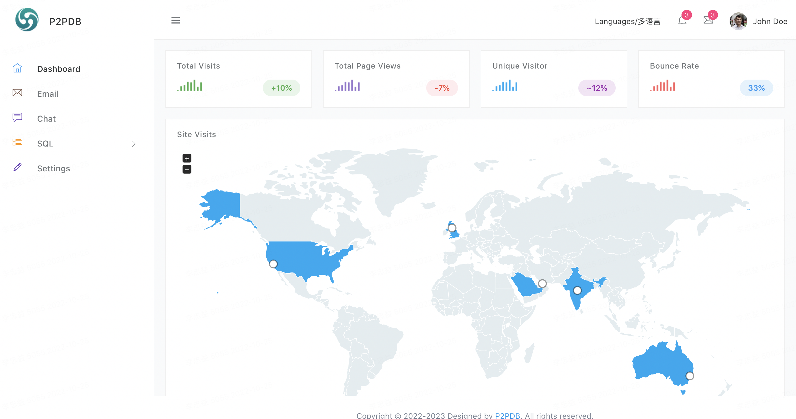

# 项目说明
这是一个用于P2PDB Demo 演示及案例演示的项目




## 1、 安装p2pdb
先安装并启动p2pdb,参考https://rock-liyi.github.io/p2pdb/#/zh-cn/install/start


## 2、在api conf 目录配置p2pdb 链接
sqlconn = root:@tcp(127.0.0.1:3306)/p2pdb

## 3、安装p2pdb-desktop
```go
cd api
go init
go mod 
go run main.go
```


## 4、使用
浏览器打开http://127.0.0.1:5200